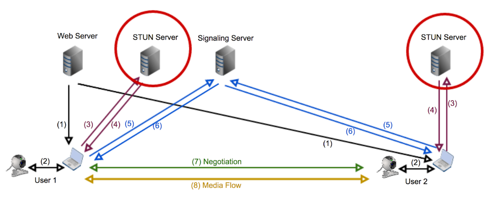
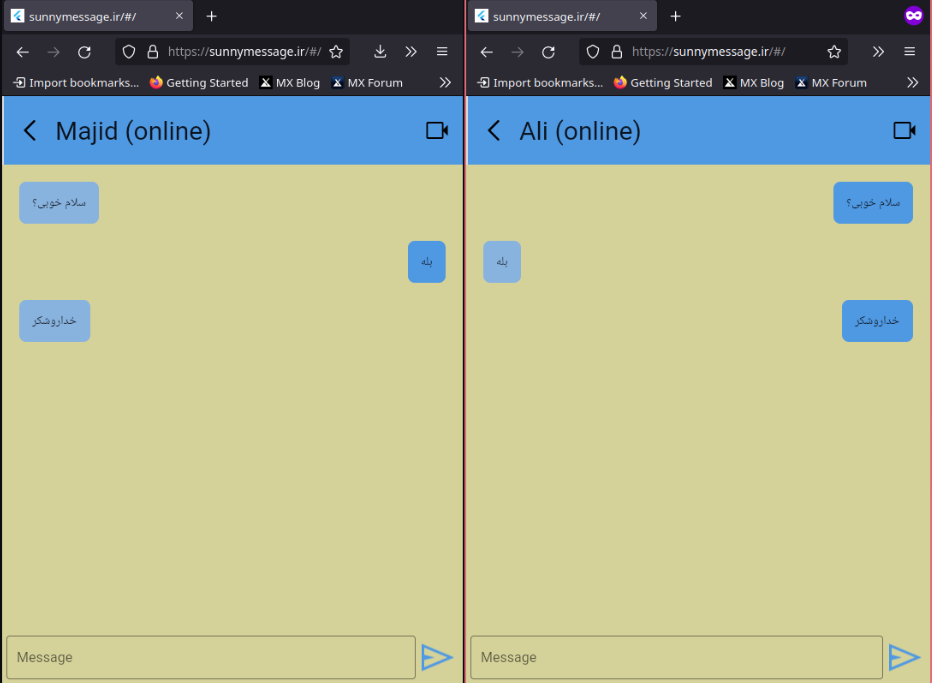
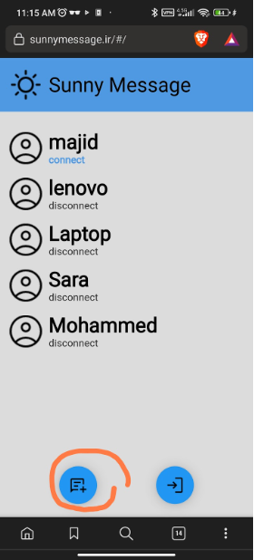
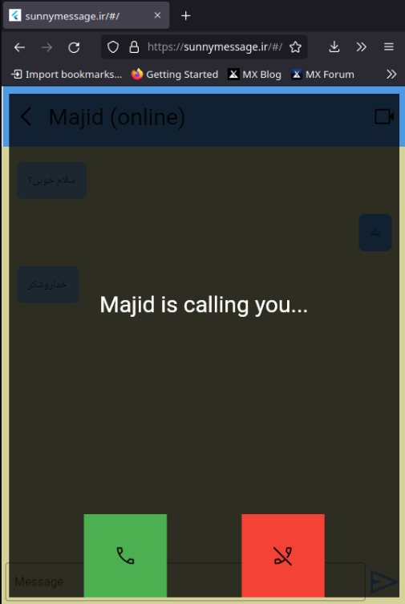
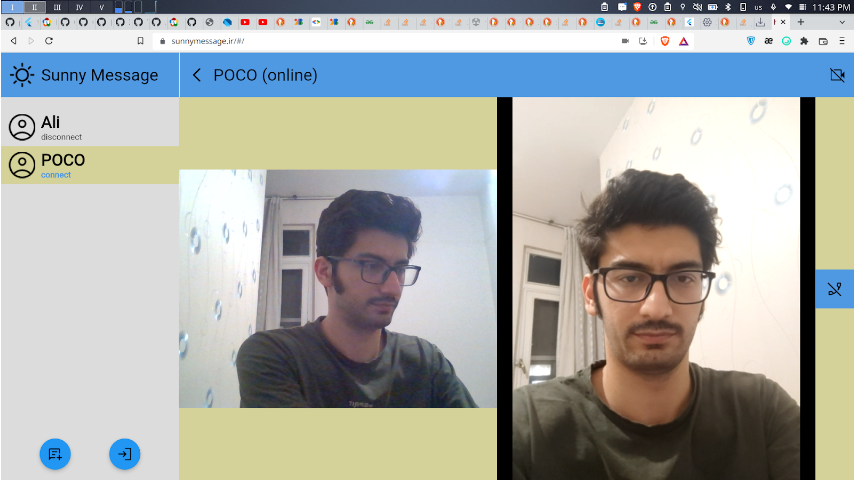
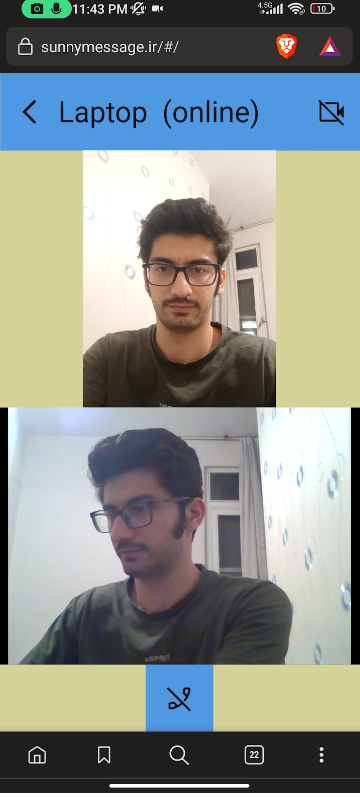

# SunnyMessage

 
This messanger app is not could base, so its sunny🙂. 

This app use WebRTC to make Peer to Peer connection between clients. 

This project is <b>not</b> using Firebase for signaling and use a simple node js backend which is also open source.
[link](https://github.com/ali77gh/SunnyMessageNodejs)

 

### How it works

  

## ScreenShots

### Text Chat:

  

### Video Call:

 

 